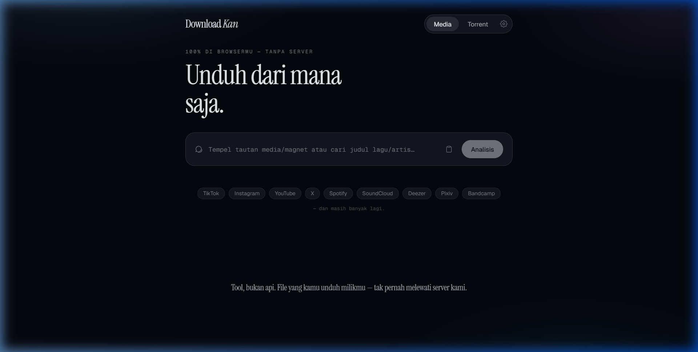
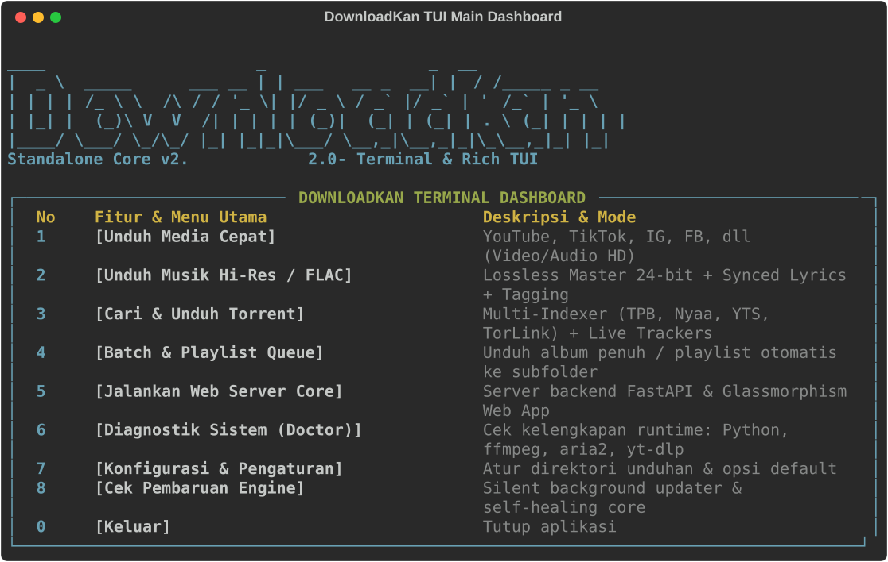
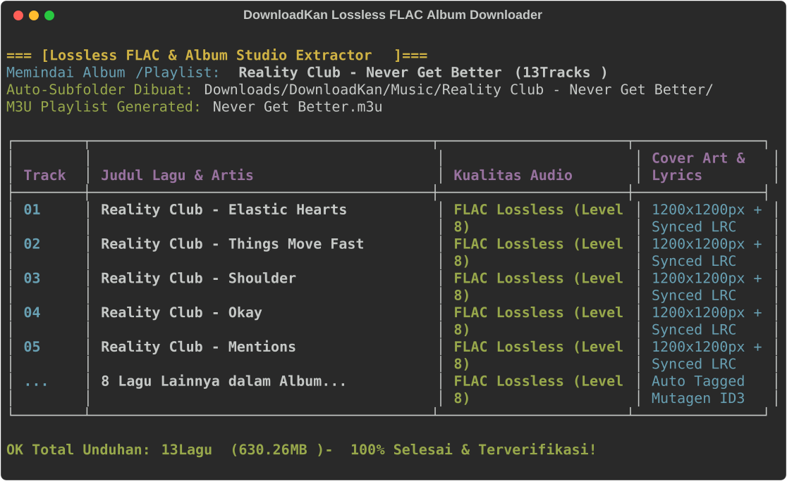
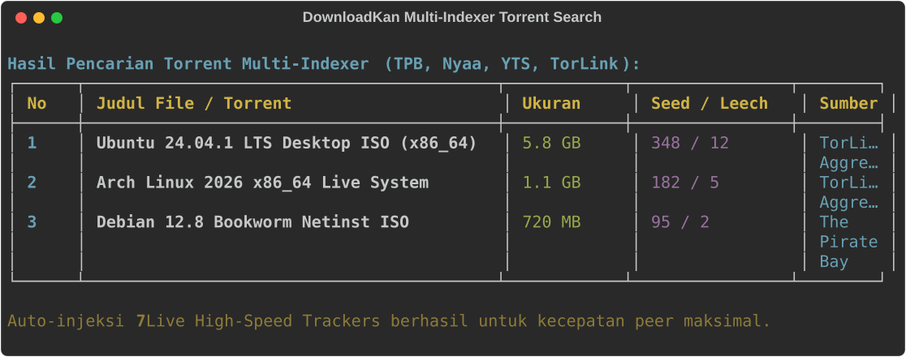
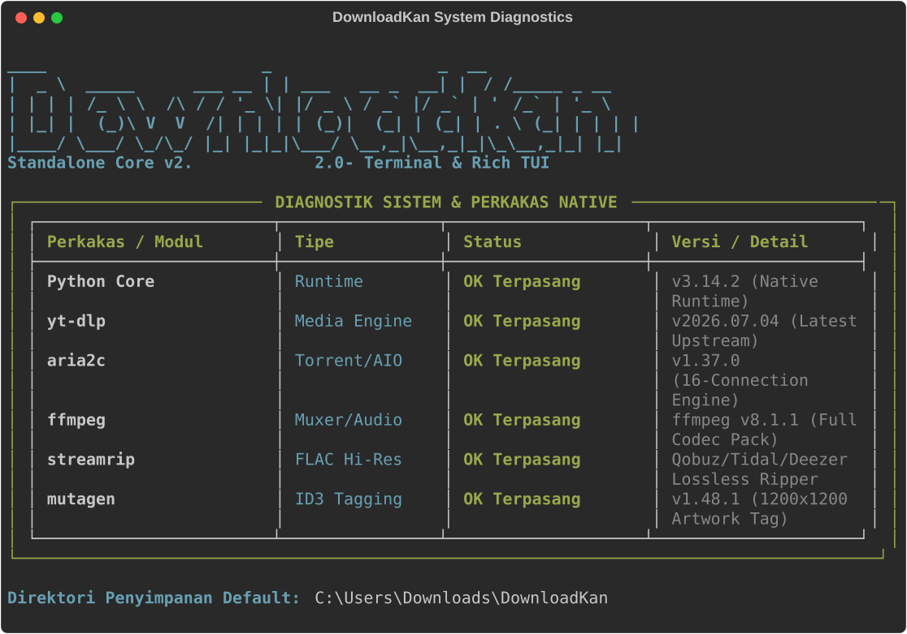

# DownloadKan (LinkDownloader)

> **Universal Media, Studio Lossless FLAC & Torrent Downloader — Standalone Local Core with Sleek Glassmorphism Web UI & Interactive Rich TUI.**

[](https://vitest.dev)
[](https://fastapi.tiangolo.com)
[](https://react.dev)
[](https://tailwindcss.com)
[](https://github.com/yt-dlp/yt-dlp)
[](https://github.com/nathom/streamrip)
[](https://github.com/baairon/torlink)

---

## 📸 Antarmuka Web & Terminal Showcase

### 🌐 1. Sleek Dark Glassmorphism Web UI
<div align="center">
  
</div>

<br />

### 💻 2. Interactive Terminal Dashboard & Rich TUI
<div align="center">
  
</div>

<br />

| 🎵 Unduhan Album Penuh FLAC & Subfolder Otomatis | 🧲 Multi-Indexer Torrent Search & Live Trackers |
|:---:|:---:|
|  |  |

<br />

| 🩺 Diagnostik Sistem (Doctor) & Auto-Updater |
|:---:|
|  |

---

## ⚡ Fitur Unggulan

- **🎥 Video & Media Sosial (yt-dlp + Nezumi + Jerexd)**:
  - Unduh dari 1000+ platform: TikTok (No Watermark), Instagram (Reels & Carousel), YouTube (hingga 4K/8K & MP3), X / Twitter, Facebook, Pixiv, Bandcamp, Threads, Bilibili.
  - **✂️ Video & Audio Time Trimmer**: Potong durasi tertentu via CLI (`--start MM:SS --end MM:SS`) atau Web UI tanpa membuang kuota.
  - **🎬 Auto-Subtitles (.SRT / Muxed)**: Unduh & embed subtitle otomatis (`--sub --sub-lang id,en`).
- **🎵 Studio Hi-Res Lossless Music (streamrip + LRCLIB + Apple Music Metadata)**:
  - **Smart Music Detection**: Otomatis mendeteksi lagu dari video YouTube dan mencocokkan ke master FLAC 24-bit studio.
  - **Album & Playlist Subfolder**: Mengurai album dari Apple Music, Spotify, YouTube Music dan otomatis mengelompokkan ke subfolder `{Artist} - {Album}/` disertai file playlist `.m3u`.
  - Cover art resolusi tinggi 1200x1200px dan lirik karaoke tersinkronisasi.
- **🧲 Torrent Multi-Source Aggregator (TorLink + aria2c / WebTorrent)**:
  - Cari torrent dari The Pirate Bay, Nyaa, YTS, dan TorLink indexer.
  - **Live High-Speed Trackers**: Otomatis menginjeksi 7 tracker aktif ke magnet URI untuk kecepatan peer maksimal.
  - Unduh native via `aria2c` multi-connection atau streaming instan di browser via WebTorrent.
- **🔄 Zero-Intervention Auto-Updater & Self-Healing**:
  - Background auto-updater senyap setiap 12 jam.
  - Self-healing on-the-fly: otomatis upgrade `yt-dlp` saat mendeteksi perubahan algoritma platform.
- **📱 Termux (Android) & Mobile Optimized**:
  - Script 1-baris instalasi untuk Termux di Android.
  - Integrasi **Android Share Menu**: klik *Share* dari Spotify/TikTok/YouTube -> pilih *Termux* -> otomatis unduh ke `/sdcard/Download/DownloadKan/`.

---

## 🚀 Instalasi Cepat (Termux / Linux / macOS)

Cukup jalankan 1 baris perintah ini di terminal:

```bash
pkg install -y curl && curl -fsSL https://raw.githubusercontent.com/NaufalSaputraa/DownloadKan/main/install.sh | bash
```

Setelah selesai, jalankan:
```bash
downloadkan
```
*(Browser HP/PC akan otomatis terbuka ke `http://127.0.0.1:8000` dengan antarmuka DownloadKan).*

---

## 💻 Penggunaan Terminal & Rich TUI

```bash
# 1. Masuk ke Dashboard Interaktif Rich TUI (Menu Berwarna & Navigasi)
downloadkan

# 2. Unduh media langsung dengan opsi format, pemotong durasi, & subtitle
downloadkan get "https://youtu.be/dQw4w9WgXcQ" -f 1080p
downloadkan get "https://youtu.be/dQw4w9WgXcQ" --start 00:30 --end 02:00 --sub --sub-lang id
downloadkan get "https://www.tiktok.com/@user/video/123456" -a

# 3. Cari & unduh musik Hi-Res / Lossless FLAC / MP3
downloadkan music "Reality Club Elastic Hearts" -f flac

# 4. Unduh album / playlist otomatis ke subfolder terorganisir
downloadkan batch "https://music.apple.com/id/album/never-get-better/1449880193"

# 5. Cari & unduh torrent langsung dari terminal
downloadkan torrent "Ubuntu 24.04"

# 6. Cek status dependensi sistem
downloadkan doctor

# 7. Jalankan server lokal & buka Web UI browser
downloadkan server
```

---

## 🛠️ Pengembangan Lokal

```bash
# 1. Clone repositori
git clone https://github.com/NaufalSaputraa/DownloadKan.git
cd DownloadKan

# 2. Install dependensi frontend & backend
npm install
pip install -r requirements.txt

# 3. Jalankan server pengembangan
npm run dev

# 4. Jalankan pengujian unit
npm test
python test_cli.py
python test_server.py
```

---

## 📄 Lisensi

MIT License © 2026 [Naufal Saputra](https://github.com/NaufalSaputraa)
