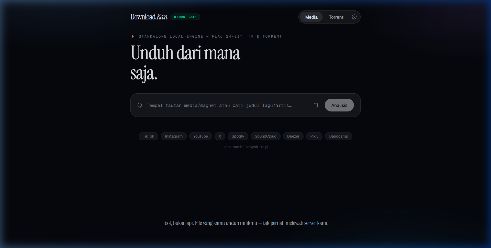
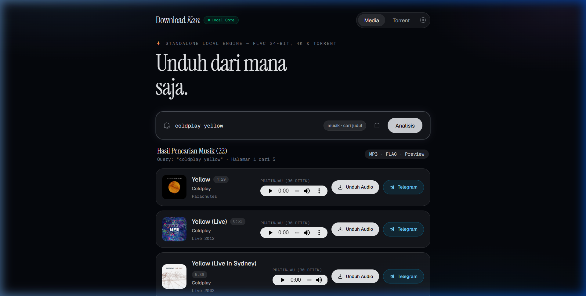
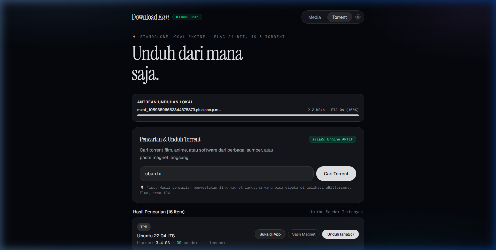
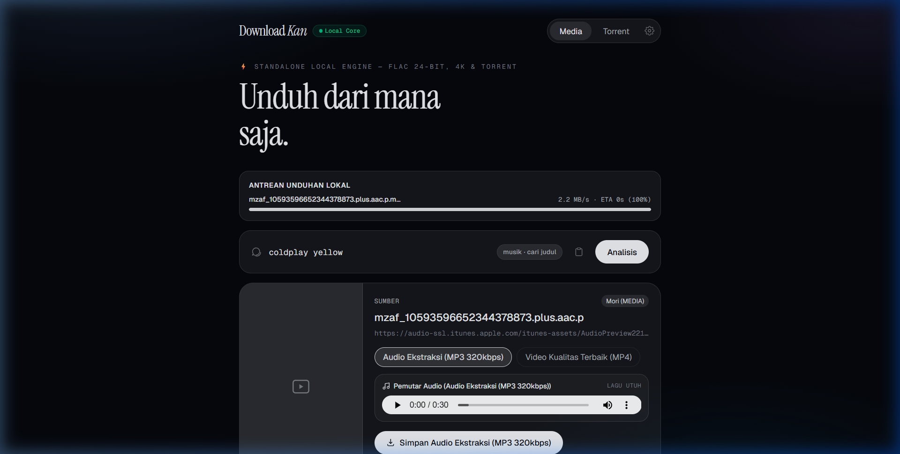
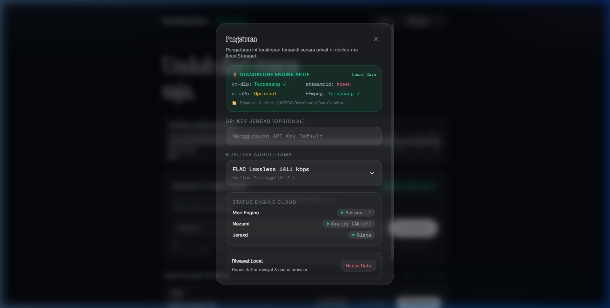

# DownloadKan (LinkDownloader)

> **Universal Media, FLAC Lossless & Torrent Downloader — Standalone Local Core with Sleek Glassmorphism Web UI.**

[](https://vitest.dev)
[](https://fastapi.tiangolo.com)
[](https://react.dev)
[](https://tailwindcss.com)
[](https://github.com/yt-dlp/yt-dlp)
[](https://github.com/nathom/streamrip)
[](https://github.com/baairon/torlink)

---

## 📸 Antarmuka & Showcase

<div align="center">
  
</div>

<br />

| 🎵 Pencarian Media & Musik FLAC | 👾 Multi-Source Torrent Aggregator |
|:---:|:---:|
|  |  |

<br />

| ⚡ Antrean Unduhan Real-Time | ⚙️ Pengaturan Engine Lokal |
|:---:|:---:|
|  |  |

---

## ⚡ Fitur Utama

- **🎥 Video & Media Sosial (yt-dlp + Mori + Nezumi)**:
  - Unduh dari 1000+ platform: TikTok (No Watermark), Instagram (Reels & Carousel), YouTube (hingga 4K/8K & MP3), X / Twitter, Facebook, Pixiv, Bandcamp, Threads, Bilibili.
- **🎵 Hi-Res Lossless Music (streamrip + LRCLIB)**:
  - Pencarian & unduhan audio FLAC 24-bit / 16-bit dari Qobuz, Tidal, Deezer, SoundCloud dengan cover art HD dan lirik tersinkronisasi.
- **👾 Torrent Multi-Source Aggregator (torlink + aria2c / WebTorrent)**:
  - Cari torrent dari 6 sumber vetted (TPB, Nyaa, 1337x, YTS, EZTV) terurut otomatis berdasarkan seeder terbanyak.
  - Unduh native via `aria2c` (100% peer TCP/UDP) atau langsung stream di browser via WebTorrent.
- **📱 Termux (Android) & Mobile Optimized**:
  - Script 1-baris instalasi untuk Termux di Android.
  - Integrasi **Android Share Menu**: klik *Share* dari Spotify/TikTok/YouTube -> pilih *Termux* -> otomatis unduh ke `/sdcard/Download/DownloadKan/`.
- **✨ Glassmorphism UI Elegan**:
  - Antarmuka monokrom minimalis ala Apple, responsif di HP, tablet, dan PC.
  - In-app Audio Preview Player, Galeri PDF Exporter, dan WebSocket Real-time Progress Bar.

---

## 🚀 Instalasi Cepat (Termux / Linux / macOS)

Cukup jalankan 1 baris perintah ini di terminal:

```bash
pkg install -y curl && curl -fsSL https://raw.githubusercontent.com/NaufalSaputraa/DownloadKan/main/install.sh | bash
```

Setelah selesai, jalankan:
```bash
downloadkan
```
*(Browser HP/PC akan otomatis terbuka ke `http://127.0.0.1:8000` dengan antarmuka DownloadKan).*

---

## 💻 Penggunaan CLI

```bash
# Buka Web UI di browser (mode standalone daemon)
downloadkan

# Atau unduh langsung instan lewat terminal
downloadkan "https://www.tiktok.com/@user/video/123456"
downloadkan "https://youtu.be/dQw4w9WgXcQ"
downloadkan "magnet:?xt=urn:btih:..."

# Bantuan perintah
downloadkan --help
```

---

## 🛠️ Pengembangan Lokal

```bash
# 1. Clone repository
git clone https://github.com/NaufalSaputraa/DownloadKan.git
cd DownloadKan

# 2. Pasang dependensi frontend
npm install

# 3. Jalankan unit test
npm run test

# 4. Build frontend
npm run build

# 5. Pasang dependensi Python backend
pip install -r requirements.txt

# 6. Jalankan server lokal
python cli.py
```

---

## 🧪 Testing & Kualitas Kode

- **Vitest Suite**: 55 unit & integration tests (`src/**/*.test.ts`, `src/**/*.test.tsx`)
- **Linter**: `oxlint` (0 warning, 0 error)
- **TypeScript**: Strict mode passing 100%

---

## 📜 Lisensi

MIT License © 2026 DownloadKan Team.
