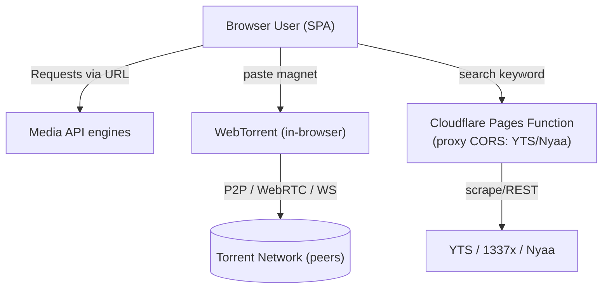

# System Architecture Specification — DownloadKan

> **Nama Produk:** DownloadKan  
> **Arsitektur:** Local-First / Client-Side + Edge Function  
> **Tech Stack:** Vite + React + TypeScript + Tailwind v4 + WebTorrent + Cloudflare Pages Functions  
> **Versi:** v1.0

---

## 1. High-Level System Architecture

LinkDownloader adalah **SPA statis tanpa backend**. Hanya 3 pihak bergerak:
browser user (semua logika), API media pihak ketiga (Nezumi/Jerexd), dan 1
Cloudflare Pages Function (proxy CORS untuk pencarian torrent).



Prinsip inti berjalan murni di client: apapun yang bisa dieksekusi di browser user (analisis, unduh, P2P)
tidak dilempar ke server. Satu-satunya "middleman" adalah Pages Function edge yang hanya berfungsi
sebagai relay untuk sumber yang memblokir CORS (terbukti di fase riset).

---

## 2. Component Breakdown

| Komponen | Teknologi | Peran & Tanggung Jawab |
| :--- | :--- | :--- |
| **Frontend SPA** | Vite + React 19 + TS | UI, routing, state, render hasil, download file |
| **Engine Registry** | `src/engines/media/index.ts` | Mendaftarkan & mencoba engine media dengan urutan prioritas |
| **Engine Nezumi** | `src/engines/media/nezumi.ts` | Memanggil `https://api.nezumi.eu.cc/api/download` (+ `/api/tiktok`), key `NezumiApi` |
| **Engine Jerexd** | `src/engines/media/jerexd.ts` | Memanggil `https://api.jerexd.my.id/api/downloader/...`, pakai key user |
| **Torrent Client** | `webtorrent` (`src/engines/torrent/webtorrent.ts`) | Parse magnet/infohash, koneksi P2P, stream, export file |
| **Torrent Search** | Cloudflare Pages Function `functions/api/torrent-search.ts` | Cari di YTS/Nyaa, balikan JSON (bypass CORS) |
| **Persistence** | `localStorage` (`src/stores/`) | History & API key user (tidak di-code) |

---

## 3. Data Flow & Communication Protocols

1. **Media flow (via proxy CORS):** Browser → `analyzeMedia(url)` → registry mengetes engine `[nezumi, jerexd]`
   berurutan → `engine.fetch(url)` → engine memanggil **proxy**:
   `GET /api/proxy/nezumi/api/download?apikey=NezumiApi&url=...`
   (dev: Vite dev-proxy ke upstream; prod: CF Pages Function `functions/api/proxy/[...proxy].ts`).
   Proxy meneruskan ke `https://api.nezumi.eu.cc/api/download?...` → JSON
   `{ status, platform, result: { title, thumbnail, downloads[] } }`.
   Download URL langsung (mis. `https://ydl.ymcdn.org/...`) dirender sebagai `a[href] download` →
   user klik → file diunduh **langsung dari CDN sumber** (tidak lewat prox; hanya metadata yang lewat prox).

2. **Torrent flow:**
   ```
   User paste magnet → parse infohash → WebTorrent.add(torrentId)
     ├─ progress: torrent.on('download', ...) → throttled ke UI (progress, speed, ratio)
     └─ done: stream → file.saveBlob / stream-to-array → Blob → download
   ```
   Progress di-throttle (maksimum update ~4–10/s) agar UI tidak jitter.

3. **Torrent search flow:**
   `GET /functions/api/torrent-search?q=...` → function edge mengambil dari YTS +
   Nyaa API, menggabungkan hasil → JSON `{ source, title, size, seeders, magnet }`.
   Frontend menampilkan + tombol "Unduh magnet" → feed ke reuse flow WebTorrent.

---

## 4. Database Schema & Data Models

Tidak ada DB server; hanya localStorage. Visual ERD ringkas:

```
[ localStorage: ld.history ] 1──[ item ]
   * id, kind: media|torrent
   * platform: 'tiktok'|'instagram'|'youtube'|'torrent'...
   * title, thumbnail, source, format, engine, status, createdAt

[ localStorage: ld.settings ] 1 [ jerexdKey, defaultFormat ]
```

Skema detail & contoh di `docs/PRD.md#7-data-model`.

---

## 5. Scalability & Performance Strategy

- **WebTorrent berjalan tanpa server**: bandwidth mengikuti user, murni P2P → semakin banyak user
  yang berbagi (seeding), semakin cepat unduhan.
- **Caching:** hasil analisis media di-cache in-memory (per session) agar tidak re-request API yang sama.
- **Lazy loading:** bundle `webtorrent` di-split (dynamic `import()` hanya dihalaman torrent).
- **Engine health:** simpan status berhasil/gagal terakhir per engine di memory → putar order failover
  dinamis (engine yang baru gagal diujikan paling akhir) — polanya mirip "circuit breaker" sederhana.
- **Error UX:** setiap lompatan engine ditandai chip pada UI (mis. "mencoba melalui Nezumi → melalui Jerexd").

---

## 6. Struktur Direktori (final)

```
LinkDownloader/
├── functions/
│   └── api/
│       └── torrent-search.ts      # Cloudflare Pages Function
├── public/
│   ├── favicon.svg
│   └── site.webmanifest
├── src/
│   ├── engines/
│   │   ├── media/
│   │   │   ├── index.ts          # type MediaEngine + registry + failover
│   │   │   ├── nezumi.ts
│   │   │   ├── jerexd.ts
│   │   │   └── (engine lain bila nanti)
│   │   └── torrent/
│   │       ├── webtorrent.ts     # wrapper WebTorrent (client)
│   │       └── search.ts         # call edge function
│   ├── utils/
│   │   ├── url-detect.ts         # detect media vs magnet + platform
│   │   └── format.ts             # format bytes, waktu, sanitasi
│   ├── hooks/
│   │   ├── useTorrent.ts
│   │   ├── useMedia.ts
│   │   └── useSettings.ts
│   ├── lib/
│   │   └── storage.ts            # wrapper localStorage
│   ├── components/
│   │   ├── ui/                   # GlassCard, Button, Input, Skeleton, Toast
│   │   ├── SearchBar.tsx
│   │   ├── MediaResult.tsx
│   │   ├── TorrentResult.tsx
│   │   └── ProgressBar.tsx
│   ├── App.tsx
│   └── main.tsx
├── docs/                       # dokumentasi ini
├── AGENTS.md
├── vite.config.ts
└── package.json
```

---

## 7. Kontrak API (Ringkas)

### Nezumi API
```
GET https://api.nezumi.eu.cc/api/download?apikey=NezumiApi&url=<encoded>
GET https://api.nezumi.eu.cc/api/tiktok  ?apikey=NezumiApi&url=<encoded>
→ { status, platform, result: { title, thumbnail, downloads: [{ type, url, isMirror }], source_url } }
```
*(Key publik gratis — terverifikasi; namun memblock CORS cross-origin, karena itu lewat proxy `/api/proxy/nezumi`.)*

**Jerexd API**
```
GET https://api.jerexd.my.id/api/downloader/<slug>?url={url}
header: apikey via query/header (login user)
→ 401 jika tanpa key; { statusCode, ... } 
```
Kategori: `aio` (auto-detect), `instagram`, `spotify`, `douyin`, `pixiv`, dst.

**Edge Function** (own)
```
GET /api/torrent-search?q=foo
→ { sources: [ { source:'YTS', items:[{title,size,seeders,magnet}] }, ... ] }
```

---

## 8. Keputusan Non-Intuitif & Catatan Arsitektur

- **Kenapa tidak Next.js?** Tidak butuh SSR/router server — murni SPA statis; Vite lebih ringan & kompakt.
- **Kenapa WebTorrent 'di browser'?** Sebagaimana torlink (zero-setup) — tanpa storage server, langsung
  simpan ke user ke file; $0 band.
- **Kenapa registry?** Karena API pihak ke-3 berubah dan maintenance bervariasi; failover sangat penting
  untuk produk yang bergantung banyak engine gratis.
- **Batasan yang HARUS ditulis di UI:** unduhan torrent butuh aktif seeder/peers; kalau magnet tidak
  sedang aktif, unduhan akan hang — UI harus menandai.


Bagian penting selesai. Lanjut ke DESIGN.

