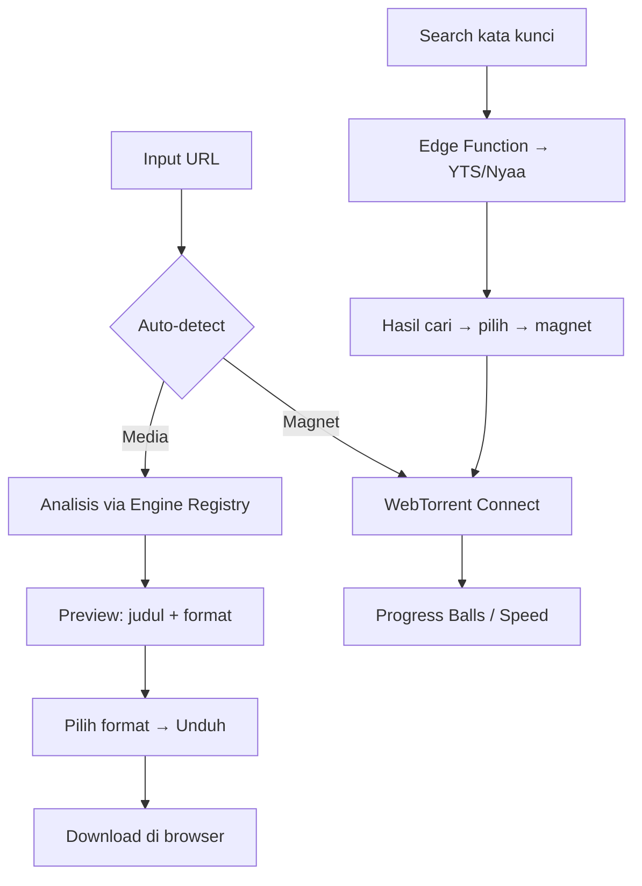

# Product Requirements Document (PRD) — DownloadKan

> **Nama Produk:** DownloadKan  
> **Status:** Active (dokumen hidup)  
> **Platform:** Web (SPA statis, mobile-responsive)  
> **Arsitektur:** Local-First / Client-Side (tanpa backend; $0 biaya server)  
> **Target Release:** MVP Fase 2 (engine media + torrent), lalu rilis publik Fase 4

---

## Riwayat Versi Dokumen

| Versi | Tanggal | Penulis | Deskripsi Perubahan |
| :--- | :--- | :--- | :--- |
| **v1.0** | 2026-08-08 | Agent (Aman) | Inisiasi PRD: riset CORS, keputusan arsitektur, daftar fitur MVP |
| **v1.1** | — | — | [Ekspansi saat implementasi] |

---

## 1. Product Overview & Filosofi

LinkDownloader adalah **downloader serba-bisa yang hidup di browser** — user tinggal menempel satu link
(TikTok, Instagram, YouTube, X, Spotify, atau magnet torrent), dianalisis otomatis, lalu diunduh
langsung ke device tanpa perlu server.

Filosofi produk:

- **Zero-infrastructure**: tanpa server sendiri. Semua proses (analisis, unduhan media, P2P torrent)
  berjalan di browser user. Hosting statis gratis (Cloudflare Pages) + 1 Edge Function untuk proxy CORS.
- **Privacy-first**: tidak ada riwayat di server, tidak ada tracking. Stream torrent (WebTorrent) tidak pernah
  lewat server kita — murni peer-to-peer.
- **Engine-agnostic**: dukungan platform tidak bergantung pada satu vendor API. Engine registry
  (pola Mori) membuat website tetap hidup walau satu API mati/ganti format.
- **Estetika premium**: glassmorphism ala Apple — monokrom, blur, translucent — minim distraksi.

---

## 2. Goals & Objectives

1. **Semua format dalam satu tempat**: dari 1 URL input, user menyelesaikan unduhan media (MP4/MP3/gambar/HD)
   maupun torrent, tanpa pindah aplikasi.
2. **Tanpa kendala teknis**: mengatasi CORS dengan arsitektur client-first + proxy edge function gratis.
3. **Resilience**: jika satu engine/API gagal, yang lain mengambil alih tanpa user berpindah UI.
4. **Privasi & transparansi**: tidak menyimpan data user, tidak menyimpan sumber.

---

## 3. Target Users (User Personas)

### 3.1. Aura — Pengguna kasual (17–30) — Konten Creator/Tim Penonton
* **Profil:** Sering menyimpan video viral TikTok/Reels, musik dari Spotify/Apple Music, atau foto IG.
  Tidak paham teknis; ingin "paste → download" secepat mungkin.
* **Kebutuhan/Pain Points:** Situs downloader terkini dipenuhi iklan/redirect palsu; video tanpa
  watermark susah didapat.
* **Peran Aplikasi:** Satu form sederhana, format jelas (MP4/MP3), tanpa iklan mengganggu, hasil langsung.

### 3.2. Rio — Power User / Peck (18–30)
* **Profil:** Familiar dengan torrent (magnet, infohash, seeding); sering download film/seri/anime via Nyaa/1337x.
* **Kebutuhan/Pain Points:** Client torrent berat/Lamban, cari sumber yang ternyata dead (zero seeders).
* **Peran Aplikasi:** Paste magnet + status progress realtime; pencarian dengan metadata seeder/size live
  (via edge function) dan unduhan P2P langsung di browser.

---

## 4. User Stories

1. **Analisis media otomatis**:
   - *Sebagai* pengguna,  
   - *Saya ingin paste URL media apa pun (TikTok, IG Reels, YouTube, Spotify),*  
   - *Sehingga* aplikasi langsung menampilkan preview, pilihan format, dan tombol unduh tanpa saya berpikir.
2. **Unduh torrent via magnet**:
   - *Sebagai* Rio,  
   - *Saya ingin* paste magnet/infohash,  
   - *Sehingga* file menarik langsung di browser via WebTorrent dengan progress & kecepatan.
3. **Cari torrent**:
   - *Sebagai* Rio,  
   - *Saya ingin* ketik kata kunci (mis. "movie 1080p brrip"),  
   - *Sehingga* saya mendapat daftar hasil dari YTS/Nyaa beserta seeder & ukuran, lalu klik untuk download.
4. **Riwayat & pengaturan**:
   - *Sebagai* user,  
   - *Saya ingin* melihat riwayat unduhan dan memasang API key Jerexd lokal,  
   - *Sehingga* tidak perlu mengulang/mengetuk key di setiap deploy.

---

## 5. Core Features (Peta Fitur & Kriteria Penerimaan)

### 🔴 P0 — Must Have (MVP)

#### 5.1. Input & Auto-Deteksi URL
* **Deskripsi:** Satu kotak input. User paste URL → sistem menentukan jenis: (a) media social (TikTok,
  IG, YT, X, Spotify, dll) atau (b) magnet/infohash torrent. Dibangun di `src/utils/url-detect.ts`.
* **Kriteria Penerimaan:**
  * **Given:** user membuka halaman root,
  * **When:** menempel URL TikTok / IG Reel / YouTube / magnet,
  * **Then:** sistem mengubah mode yang benar dan menampilkan tombol "Analisis" (media) atau langsung
    memanggil WebTorrent (magnet).

#### 5.2. Analisis Media + Preview + Unduh (Engine Registry)
* **Deskripsi:** Permintaan ke engine media dengan urutan failover: **Nezumi** (utama) → **Jerexd**
  (fallback, key user). Menampilkan judul, thumbnail, daftar format (MP4/MP3/HD), lalu unduh via
  atribut `download`.
* **Kriteria Penerimaan:**
  * **Given:** user menempel link TikTok yang valid,
  * **When:** klik "Analisis",
  * **Then:** ditampilkan preview (thumbnail + judul) + tombol unduh per format; jika Nezumi gagal:
    sistem otomatis mencoba Jerexd dengan key user; jika dua-duanya gagal → pesan yang jelas
    "Engine untuk situs ini sedang mengalami masalah".

#### 5.3. Torrent — Paste Magnet / Infohash (WebTorrent)
* **Deskripsi:** `src/engines/torrent/webtorrent.ts` menginstansiasikan WebTorrent, memparsing magnet/infohash,
  dan men-download file langsung di browser user.
* **Kriteria Penerimaan:**
  * **Given:** user paste magnet yang valid,
  * **When:** klik "Mulai Unduh",
  * **Then:** muncul progress bar (%, speed, ETA), dan saat selesai file tersimpan secara otomatis.

#### 5.4. Torrent Search (via Cloudflare Pages Function)
* **Deskripsi:** Input kata kunci → fungsi edge `functions/api/torrent-search.ts` memproksi permintaan
  ke sumber (YTS, Nyaa) dan bypass CORS. Output: daftar { title, size, seeders, magnet }.
* **Kriteria Penerimaan:**
  * **Given:** user di-halaman Torrent,
  * **When:** menulis kata kunci lalu enter,
  * **Then:** muncul hasil dari beberapa sumber terkelompok, tombol "Download magnet" meneruskan ke WebTorrent.
- *Catatan:* YTS/TPB/Nyaa langsung dari browser **diblokir CORS** (terbukti di riset) — oleh karena itu
  wajib melalui edge function.

### 🟡 P1 — Should Have (Pasca-MVP)

- **P1.1** Koleksi/album & carousel foto (IG, Pinterest multi-image) — pilih per-gambar.
- **P1.2** Engine cadangan tambahan untuk situs yang tidak ada di Nezumi (mis. RedNote, Facebook) via Jerexd.
- **P1.3** Pause/save/resume context (WebTorrent sudah punya) & pindah folder penyimpanan per-item.
- **P1.4** PWA (installable, offline shell) & share-target (dari sistem share HP masuk app).

### 🟢 P2 — Nice to Have

#### P2.1: Editor / exporter PDF (seperti Mori) untuk galeri gambar jadi PDF.
#### P2.2: Dashboard riwayat & statistik unduhan (direktori files, ukuran total, summary source).
#### P2.3: Autentikasi opsional via PIN/lokal untuk menyembunyikan riwayat.

---

## 6. Technical Requirements & Stack

* **Framework/Platform:** Vite + React 19 + TypeScript (SPA statis)
* **UI/Styling:** Tailwind CSS v4 + Framer Motion
* **Torrent client:** `webtorrent` (browser)
* **Edge Functions:** Cloudflare Pages Functions (`/functions/`) — proxy CORS torrent search
* **State/Cache:** `localStorage` (riwayat, setting, keys) + context/state ringan
* **API / Integrasi:** Nezumi API (`apikey` gratis `NezumiApi`), Jerexd API (key user)
* **Kriteria Performa:** First load < 3s; respon Nezumi < 1.5s avg; UI 60fps (animasi ringan).

---

## 7. Data Model & Database Schema

Tidak ada database server. `localStorage` JSON:

### 7.1. Kunci `ld.history`
```
{
  "v": 1,
  "items": [ {
    "id": "uuid",
    "kind": "media" | "torrent",
    "platform": "tiktok" | "instagram" | ... | "torrent",
    "title": "string",
    "thumbnail": "string|null",
    "source": "https://...",
    "format": "MP4 | MP3 | ...",
    "fileSize": number|null,
    "engine": "nezumi" | "jerexd",
    "status": "done" | "failed" | "downloading",
    "createdAt": "ISO",
    "localPath": "string|null"   // torrent: jalur penyimpanan
  } ]
}
```

### 7.2. Kunci `ld.settings`
```
{ "jerexdKey": "string|null", "defaultFormat": "mp4", "themeFollowing": "system" }
```

---

## 8. UI/UX Design System Specification

Bagian lengkap ada di `docs/DESIGN.md`. Ringkas:

### 8.1. Tone
Glassmorphism premium ala Apple — monokrom minimalis, elegan, glass dengan blur lembut, bokeh background.

### 8.2. Warna
- Background: gradien halus (abu-abu/putih lembut atau dark mode).
- Surface/card: glass `backdrop-blur`, translucency tinggi, border tipis low-opacity.
- Text: near-black / near-white; accent minimal (putih).
- Tidak ada aksen warna mencolok.

### 8.3. Tipografi
- Inter / System-ui; heading semibold; radius lembut (12–16px).

---

## 9. Success Metrics (Target Kinerja & Adopsi)

### 9.1. KPIs
- **Tingkat selesai alur:** ≥ 90% unduhan hanya setelah sekali analisis.
- **Reliability engine:** ≥ 99% permintaan media berhasil dengan fallback engine (atau upaya kedua).
- **Waktu respon UI:** Analisis < 2s untuk URL populer.
- **Zero server cost** (no budget infra).

### 9.2. OKRs
- **Objective 1: Galeri MVP berfungsi tanpa server.**
  - KR1: 100% fitur P0 jalan di `npm run dev` & produksi Preview Pages.
  - KR2: Analisis media & unduhan torrent berhasil diuji dengan URL nyata di lingkungan user.

---

## 10. Risiko & Mitigasi Teknis

1. **API Nezumi mati / limit / ubah format**:
   - *Risiko:* Engine utama down → semua media gagal.
   - *Mitigasi:* Engine registry + failover ke Jerexd; pesan error & health indicator per engine; opsi
    tambah engine baru tanpa refactor besar.
2. **API pihak ketiga blokir CORS / blokir IP datacenter**:
   - *Risiko:* Permintaan dari browser/user dibatasi oleh kebijakan CORS atau limit IP. *(Nezumi & Jerexd memang memblokir CORS cross-origin — teruji 2026-08.)*
   - *Mitigasi:* Semua panggilan analisis media lewat proxy CORS (`/api/proxy/*` — CF Pages Function di prod, Vite dev-proxy di lokal); file unduhan tetap langsung dari CDN sumber, hanya metadata yang lewat prox.
3. **WebTorrent gagal connect / seeder lemah / tracker blok**:
   - *Risiko:* Magnet tidak dapat tersambung, atau error tracker.
   - *Mitigasi:* Menampilkan status 'connecting', support infohash, dan opsi tracker tambahan;
     UI jelaskan bahwa P2P butuh seeder aktif.
4. **Legal / DMCA**:
   - *Risiko:* Distribusi konten copyright.
   - *Mitigasi:* Modul unduhan hanya tool (bukan direktori konten); tombol DMCA/feedback; disclaimer di
     footer; TIDAK menyimpan file server-side.

---

## 11. Alur Pengguna (User Flow)



### 11.1. Alur utama media
1. **Paste** URL di kolom.
2. **Deteksi** platform & jenis.
3. **Analisis** → registry coba Nezumi → fallback Jerexd → output preview + format list.
4. **Unduh** → file via browser download.

---

## 12. Arsitektur Kode & Struktur Direktori

Lihat `docs/ARCHITECTURE.md#struktur-direktori` — ringkas:

```
LinkDownloader/
├── functions/          # Cloudflare Pages Functions (torrent search)
├── public/             # favicon, manifest
├── src/
│   ├── engines/        # media (nezumi.ts, jerexd.ts, index.ts) + torrent (webtorrent.ts, search.ts)
│   ├── utils/          # url-detect.ts, format.ts
│   ├── hooks/          # useToast, useTorrent, useMediaEngines
│   ├── components/     # ui glass, cards, progress, input, tabs
│   ├── stores/         # history store (localStorage)
│   ├── App.tsx
│   └── main.tsx
├── functions/          # Cloudflare Functions
├── docs/               # dokumentasi ini
└── AGENTS.md
```

---

## 13. Catatan Keputusan Teknis (ADRs)

Semua ADR disimpan di file `docs/ADR-*.md`:

- **ADR-001: Arsitektur client-side tanpa backend** — $0, privasi, simpel deploy.
- **ADR-002: Nezumi API sebagai engine utama media (gratis + CORS + key publik)** — dan Jerexd fallback.
- **ADR-003: WebTorrent in-browser untuk unduhan torrent** — P2P, tanpa server.
- **ADR-004: Edge Function (proxy CORS) untuk pencarian torrent** — YTS/Nyaa blokir CORS langsung.
- **ADR-005: Porting skraper Mori via proxy** untuk platform yang tak tercakup API (Pixiv/Bilibili/Bandcamp, dll).
- **ADR-006: Vite + React + Tailwind v4 (bukan Next)** — SPA statis ringan.
- **ADR-007: localStorage sebagai persistence** — history & key user.

---

## 14. Persyaratan Non-Fungsional (NFR)

### 14.1. Performansi
* Startup < 3s (3G), bundle build teroptimasi, code-splitting module berat (webtorrent) saat halaman torrent.

### 14.2. Aksesibilitas
* Kontras teks ≥ 4.5:1; touch target min 44px; semua tombol interaktif memakai `aria-label`; fokus ring yang jelas.

### 14.3. Keamanan & Privasi
* API keys disimpan hanya `localStorage` (jangan ke code); tidak mengirim data ke server kita;
* sanitasi / escape judul URL saat dirender; CSP di production; framework sanitasi XSS.

---

## 15. Strategi Pengujian (QA)

Ringkas di `docs/TESTING.md`. Target: cakupan unit pada utility (url-detect, format)
& vitest untuk engine registry dengan mock, e2e Playwright untuk alur media + magnet.

---

## 16. Rencana Sprint & Roadmap

Butuh Gantt lengkap ada di `docs/PLAN.md`. Peta besar:

```
Fase 1 – Scaffold : Vite+TS+Tailwind, autoskill, struktur folder
Fase 2 – Media     : engine registry, analyze, preview, download + fallback
Fase 3 – Torrent   : WebTorrent + search via Functions
Fase 4 – UI & Deploy : polish glassmorphism, PWA optional, deploy CF Pages
```

---

## 17. Kamus Istilah (Glossary)

* **Engine** — modul yang memanggil 1 API penyedia unduhan (mis. `nezumi.ts`).
* **Engine Registry / Failover** — cara mencoba engine A, jika gagal lanjut ke B (pola Mori).
* **Magnet / Infohash** — link torrent (string panjang `magnet:?xt=urn:btih:<hash>`). WebTorrent mem-
  Parse dan bergabung P2P.
* **Edge Function** — Cloudflare Workers/Pages Functions: script tanpa server yang berjalan di edge
  network (free tier) untuk meneruskan request tanpa CORS.
* **Glassmorphism** — style UI: blur + transparansi + border halus (backdrop-filter).
* **WebTorrent** — library torrent yang jalan di browser (WebRTC/WebSocket), tidak perlu install.

